# Five Telegram channels in one corpus: a combined notebook-based analysis

This article analyzes the pooled five-channel corpus produced by [`notebooks/allchannels.ipynb`](../notebooks/allchannels.ipynb). It follows the same notebook-driven house style as the existing channel write-ups, but it is important to read it as a **combined-corpus report**, not as a side-by-side channel comparison.

Unlike [`docs/israel-news-channels-analysis.md`](israel-news-channels-analysis.md), which compares channels separately, `allchannels.ipynb` fetches the same per-channel message cap, merges all five pulls into one chronologically sorted corpus, and then runs Sections 6-14 on that shared dataset.

The combined notebook currently covers these five channels:

- **Press TV** — [`presstv`](https://t.me/presstv)
- **ILTV Israel News 24/7** — [`iltvnews`](https://t.me/iltvnews)
- **Jewish Breaking News - JBN** — [`jewishbreakingnewstelegram`](https://t.me/jewishbreakingnewstelegram)
- **The Times of Israel** — [`thetimesofisrael2022`](https://t.me/thetimesofisrael2022)
- **Amir Tsarfati / Behold Israel** — [`beholdisraelchannel`](https://t.me/beholdisraelchannel)

> **Status.** This write-up is a first pass grounded in the saved outputs embedded in `notebooks/allchannels.ipynb` as it exists today. The notebook's own write-target table still describes the analysis products as in-memory outputs, but the saved notebook figures and tables have now been extracted into [`docs/assets/all-channels/`](./assets/all-channels/) for this report. The inline graphs below therefore come directly from the notebook's stored outputs rather than from a fresh export pipeline rerun. Section 6 and Section 10 event annotations are still placeholder candidates in the notebook rather than hand-reviewed final labels, and the topic / entity / rhetoric / phrase Plotly figures are available both as interactive HTML exports and, for key views, as static PNG snapshots.

## Executive summary

Five findings stand out most clearly.

1. **The combined corpus is large, media-heavy, and strongly weighted toward the late window.** The notebook merges **6,000 messages** across **122 observed days**, with **62.0%** of all posts carrying media. But the pooled timeline is not balanced: the lexical section shows only **295** text-ready messages in the first bin versus **3,143** in the last, so late-period findings reflect both real events and the fact that more channels are simultaneously represented later in the window.
2. **The emotional baseline is still negative and fear-dominant even after pooling five different editorial styles.** Mean sentiment is **-0.236** across **5,097** scored messages. **Neutral** is still the largest sentiment label (**58.9%**), but **fear** is the dominant emotion overall (**38.7%**), followed by neutral (**26.2%**) and anger (**15.1%**).
3. **The topic map fragments instead of collapsing.** The saved topic summary runs from **Topic 0** through **Topic 90** plus a **Noise / Mixed** bucket. The largest single bucket is actually **Noise / Mixed (1,041 messages)**, while the biggest named clusters are only **188**, **179**, **164**, and **163** messages. In other words, the pooled corpus behaves like a stitched-together landscape of many small editorial islands rather than one dominant semantic field.
4. **The actor layer converges on the same geopolitical core, but pooled boilerplate leaks into it.** The top entities are **Iran (1,766)**, **Israel (1,176)**, **US (1,163)**, **Iranian (894)**, **Israeli (766)**, **Lebanon (532)**, **Trump (520)**, **Hezbollah (471)**, and **IDF (334)**. But the combined run also surfaces **WHATSAPP GROUP (526)** and **WHATSAPP CHANNEL WHATSAPP GROUP (224)**, showing that JBN's self-promotional boilerplate materially shapes the cross-channel entity and phrase outputs.
5. **Media vs text-only differences are strong in the pooled corpus, but they mostly describe channel mix rather than one channel's house style.** Media posts are **less negative** than text-only ones, and the notebook reports statistically significant differences in **posting hour, dominant sentiment, dominant emotion, dominant topic, and dominant frame**. The largest effect is on **topic mix** (**effect size 0.4086**), which makes sense in a pooled dataset where formats and outlets are entangled.

## Scope and method

### Channels included

| Channel | Notebook title | Telegram slug | Messages pulled |
|---|---|---|---:|
| Press TV | Press TV | `presstv` | 1,200 |
| ILTV Israel News 24/7 | ILTV Israel News 24/7 | `iltvnews` | 1,200 |
| Jewish Breaking News - JBN | Jewish Breaking News - JBN | `jewishbreakingnewstelegram` | 1,200 |
| The Times of Israel | The Times of Israel | `thetimesofisrael2022` | 1,200 |
| Behold Israel | Amir Tsarfati | `beholdisraelchannel` | 1,200 |

### Corpus-level summary

| Metric | Value |
|---|---:|
| Total messages | 6,000 |
| Text-bearing messages | 5,109 |
| Sentiment-scored messages | 5,097 |
| Topic-ready messages | 5,097 |
| Lexical / phrase-ready messages | 5,094 |
| Media-bearing messages | 3,720 |
| Media share | 62.0% |
| Reply edges | 145 |
| Observed days | 122 |
| Start | 2025-12-17 18:22 UTC |
| End | 2026-04-17 22:10 UTC |
| Messages using translation | 6 |

Language mix from the translation section:

- **English:** 5,104 messages (**85.1%**)
- **Undetermined:** 891 (**14.9%**)
- **Hebrew:** 4
- **Arabic:** 1

Notes:

- All timestamps below are **UTC**.
- This notebook is best read as a **pooled narrative landscape**, not as a controlled cross-channel benchmark.
- Temporal shifts are partly **composition effects**: some channels begin much later in the overall window, so March-April contains many more concurrent sources than December-January.
- Reply analysis is especially delicate here because Telegram `message_id` values are channel-local. The notebook itself warns that any apparent cross-channel reply match should be treated as incidental.
- Figures, interactive HTML, and CSV table exports extracted from the saved notebook outputs are now embedded or linked below.

---

## 1. Cadence: a pooled corpus that thickens sharply toward April

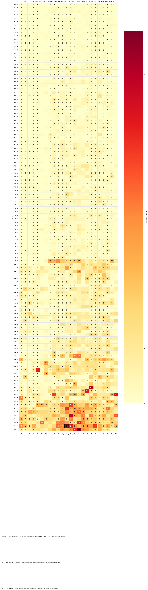

_Figure 1a. Hour-by-hour message volume across the pooled 122-day window._

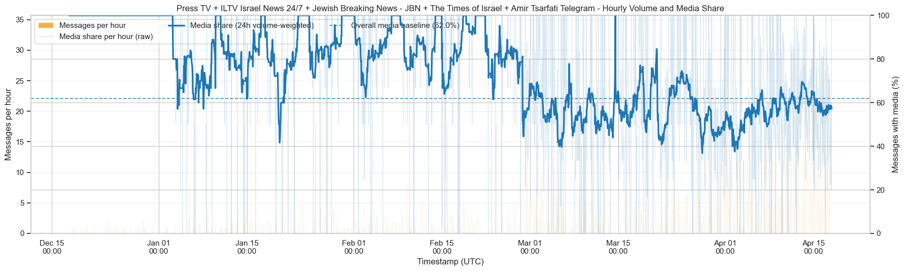

_Figure 1b. Volume and media-share view from the notebook's cadence section._

At the highest level, the merged dataset behaves like a large, fast, media-rich news stream:

- **6,000 messages** across **122 observed days**
- **49.2 messages per day** on average
- **62.0%** of messages carry media
- **Busiest day:** **2026-04-16** with **314** messages
- **Peak hour:** **2026-04-17 14:00 UTC** with **34** messages

But the key cadence finding is not just speed. It is **time imbalance**.

The daily summary begins with tiny December counts — **2**, **8**, **11**, **4**, **9** messages on the first five observed days — and ends with large April totals like **248**, **208**, **233**, **314**, and **232**. The lexical section makes the same point numerically: the four equal time bins contain **295**, **459**, **1,197**, and **3,143** text-ready messages respectively.

That means the combined corpus is not a stable panel where each week contains the same outlet mix. Instead, it thickens as more of the 1,200-message channel windows overlap in the later period. So any late-window “surge” should be read in two layers:

1. **real event intensity**, and
2. **more channels contributing simultaneously**.

The top spike-hour table also shows how heterogeneous the merged stream becomes at peak moments. The ten largest hourly spikes include windows led by:

- Jerusalem Marathon / Israeli human-interest coverage
- Behold Israel travel / prophecy-event posting
- naval blockade / Strait of Hormuz language
- Hezbollah and IDF strike updates
- Haifa missile-casualty reporting
- diplomacy and ceasefire commentary

That variety is the point. `allchannels.ipynb` does not behave like one outlet with one rhythm. It behaves like **several editorial systems stacked on top of each other**.

---

## 2. Tone: negative-leaning overall, with fear as the shared emotional floor

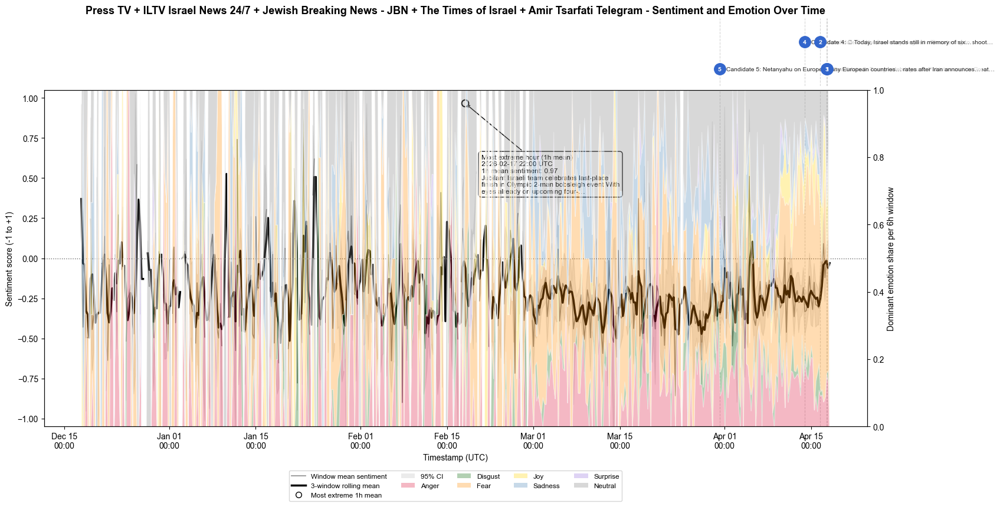

_Figure 2a. Sentiment over time across the merged five-channel corpus._

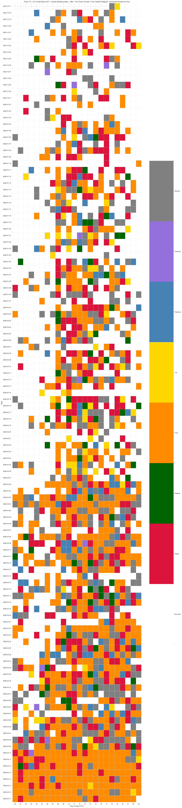

_Figure 2b. Hourly dominant-emotion heatmap across the same window._

Across **5,097** scored messages, the notebook reports:

- **Mean sentiment:** **-0.236**
- **Dominant emotion overall:** **fear**

Sentiment-label distribution:

- **Neutral:** 3,004 (**58.9%**)
- **Negative:** 1,777 (**34.9%**)
- **Positive:** 316 (**6.2%**)

Emotion-label distribution:

- **Fear:** 1,974 (**38.7%**)
- **Neutral:** 1,336 (**26.2%**)
- **Anger:** 768 (**15.1%**)
- **Sadness:** 444 (**8.7%**)
- **Joy:** 286 (**5.6%**)
- **Disgust:** 219 (**4.3%**)
- **Surprise:** 70 (**1.4%**)

So even after mixing five channels with different styles, the emotional center of gravity barely moves away from the pattern already visible in the single-channel and three-channel write-ups:

- a **neutral-label plurality**,
- a **negative aggregate mean**, and
- **fear** as the dominant emotion.

That combination matters. The pooled corpus is not “negative” because every message is classified negative. It is negative because a large amount of neutral-looking reporting sits inside a broader discourse of danger, war, retaliation, casualties, and geopolitical threat.

The saved notebook does surface candidate event-annotation rows, but they are not yet hand-curated. The five candidate timestamps cluster around **2026-03-31** and **2026-04-13 to 2026-04-17**, with preview texts tied to Trump, Hormuz, Hegseth warnings, Holocaust remembrance, and Israel-Europe confrontation language. That is useful as a pointer, but until those placeholders are reviewed, the sentiment timeline is best read as a **broad tonal arc** rather than a precisely annotated event chronology.

---

## 3. Themes: a fragmented map with one very large noise bucket

_Interactive notebook exports for this section: [Topic scatter](./assets/all-channels/topic_scatter.html) · [Topic prevalence](./assets/all-channels/topic_prevalence.html) · [Topic over time](./assets/all-channels/topic_time.html)_

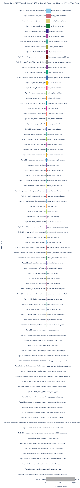

_Figure 3a. Static export of the pooled topic-prevalence figure._

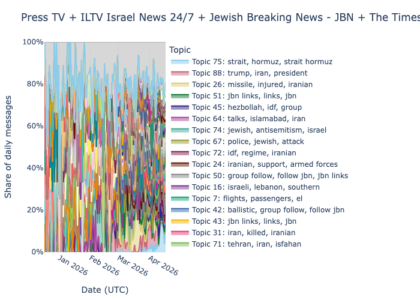

_Figure 3b. Static export of topic-share change over time across the combined corpus._

The topic section is where the pooled nature of the notebook shows up most clearly.

The saved summary table runs from **Topic 0** through **Topic 90**, plus **Noise / Mixed**. In other words, the notebook is surfacing **dozens of small topic clusters**, not a handful of large ones.

The most important single number is this one:

- **Noise / Mixed — 1,041 messages**

That is larger than any named cluster. Among named topics, the top visible clusters are:

- **Topic 75: strait, hormuz, strait hormuz** — **188** messages
- **Topic 88: trump, iran, president** — **179**
- **Topic 26: missile, injured, iranian** — **164**
- **Topic 51: jbn links, links, jbn** — **163**
- **Topic 45: hezbollah, idf, group** — **101**

A few things follow from that pattern.

### The corpus does not collapse into one shared story

Unlike ILTV's first-pass monolithic topic model, the combined corpus does **not** form one dense semantic region. The top named clusters are only about **2% to 4%** of topic-ready messages each. That means the five-channel blend is too heterogeneous to reduce cleanly to one or two dominant narratives.

### The noise bucket is substantively meaningful

A **20%+** noise bucket is not just a modeling artifact here. It tells us that the combined corpus contains many messages that are either:

- too stylistically different from one another,
- too short or too one-off,
- too channel-specific in phrasing,
- or simply too mixed to cluster tightly under the default settings.

That is exactly what you would expect from a corpus that combines article-headline posts, wire-style updates, self-promotional CTA posts, commentary, and devotional/event language.

### JBN boilerplate is visible as a topic in its own right

The presence of **Topic 51: jbn links, links, jbn** at **163 messages** is one of the clearest pooled-corpus artifacts. The model is not just finding geopolitical themes; it is also finding **channel-template language**.

That matters because it means some of the combined topic landscape is about **posting format**, not just subject matter.

### The long tail is very long

The tail of the visible summary reaches small clusters like:

- **Topic 78: modi, prime minister, prime** — 15
- **Topic 55: hezbollah, idf, southern** — 15
- **Topic 6: rafah, crossing, gaza** — 15
- **Topic 11: ceasefire, displaced, southern** — 15

That is a useful description of the notebook's behavior: it finds many **beat-sized islands** rather than a few dominant continents.

---

## 4. Actors: the pooled cast still resolves into Iran, Israel, and the US

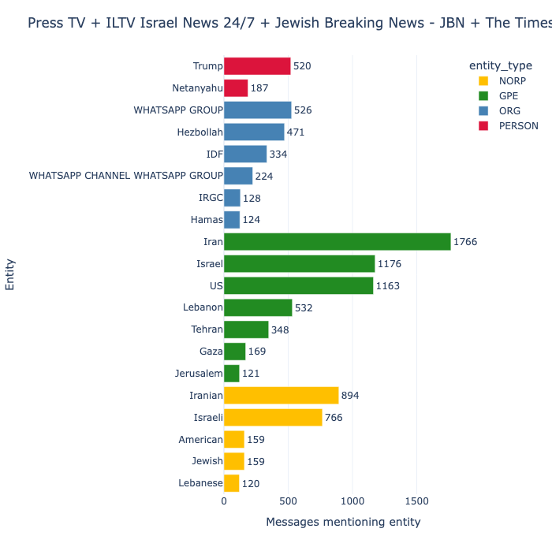

_Figure 4a. Static export of the top-entities bar chart._

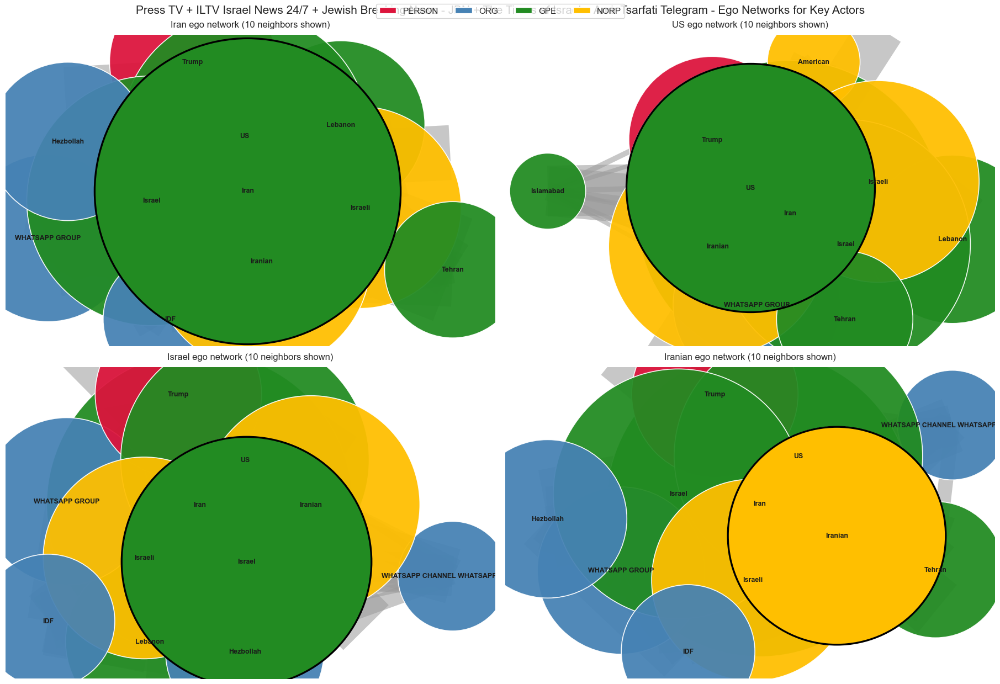

_Figure 4b. Ego-network panels extracted from the notebook's named-entity section._

_Interactive notebook exports for this section: [Entity bar chart](./assets/all-channels/entity_top_entities.html) · [Entity network](./assets/all-channels/entity_network.html)_

If the topic map fragments, the entity map recenters.

Entity-extraction summary:

- **5,097** messages analyzed for entities
- **4,994** messages with at least one entity
- **24,071** total entity mentions
- **4,409** unique normalized entities before graph filtering
- **688** nodes and **3,775** edges after filtering

Top entities by message count:

1. **Iran** — 1,766
2. **Israel** — 1,176
3. **US** — 1,163
4. **Iranian** — 894
5. **Israeli** — 766
6. **Lebanon** — 532
7. **WHATSAPP GROUP** — 526
8. **Trump** — 520
9. **Hezbollah** — 471
10. **Tehran** — 348
11. **IDF** — 334
12. **WHATSAPP CHANNEL WHATSAPP GROUP** — 224

The strongest co-mention pairs are even clearer:

- **Iran ↔ US** — 709
- **Iran ↔ Israel** — 405
- **Iran ↔ Iranian** — 347
- **Iranian ↔ US** — 283
- **Iran ↔ Trump** — 276
- **Israel ↔ US** — 272
- **Iran ↔ Israeli** — 270
- **Hezbollah ↔ Lebanon** — 257
- **Trump ↔ US** — 238

So the pooled corpus still converges on the same actor triangle already visible elsewhere in the repo:

- **Iran**
- **Israel / Israeli**
- **US / Trump**

with **Lebanon, Hezbollah, Tehran, and IDF** as the stable secondary ring.

The community table reinforces this structure. The biggest communities are:

- **C1** — Iran, US, Iranian, Trump, Tehran
- **C2** — Israel, WhatsApp-channel boilerplate, Netanyahu, Gaza, Jewish
- **C3** — Israeli, Lebanon, WhatsApp Group, Hezbollah, IDF

That is a useful pooled-corpus result in its own right. The topic layer looks messy; the actor layer looks comparatively stable.

The main caution is the same one already seen in the topic section: **JBN promotional text leaks into the entity graph**. `WHATSAPP GROUP` is not a geopolitical actor, but it is a major normalized entity in the combined run, so any narrative reading has to mentally subtract that noise.

---

## 5. Framing: the model mostly says “mixed,” but the decisive labels tilt toward threat, calls, and authority

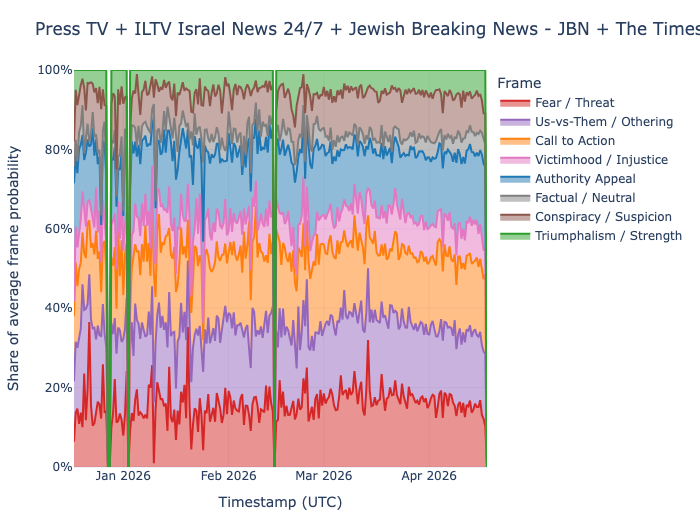

_Figure 5a. Static export of the rhetoric-over-time figure._

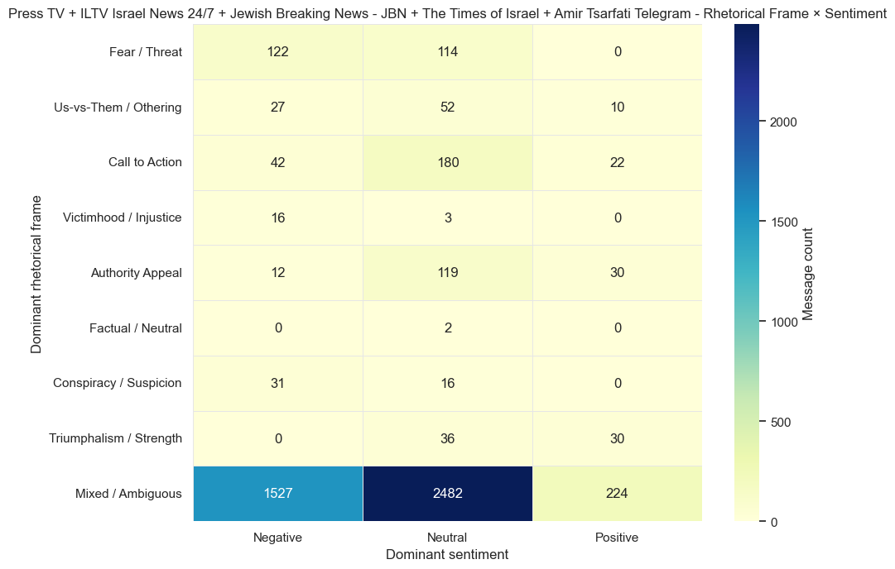

_Figure 5b. Cross-tab heatmap between dominant frame and dominant sentiment in the pooled corpus._

_Interactive notebook exports for this section: [Rhetoric over time](./assets/all-channels/rhetoric_over_time.html) · [Rhetoric transition](./assets/all-channels/rhetoric_transition.html)_

The rhetoric section is informative, but it needs to be read cautiously.

The notebook scored **5,097** messages with an ambiguity threshold of **0.35**, and the result is overwhelmingly:

- **Mixed / Ambiguous — 4,233 messages (83.0%)**

Among the non-ambiguous labels, the biggest categories are:

- **Call to Action** — 244 (**4.8%**)
- **Fear / Threat** — 236 (**4.6%**)
- **Authority Appeal** — 161 (**3.2%**)
- **Us-vs-Them / Othering** — 89 (**1.7%**)
- **Triumphalism / Strength** — 66 (**1.3%**)
- **Conspiracy / Suspicion** — 47 (**0.9%**)

Two things are worth saying explicitly.

### First, ambiguity is itself a finding

An **83% mixed / ambiguous share** suggests that the general-purpose frame taxonomy is struggling to assign clean single-label rhetoric to a corpus made up of headlines, short bulletins, article teasers, promotional inserts, commentary, and war dispatches from multiple outlets. That does not make the output useless. It means the decisive labels should be read as **edge highlights**, not as a complete partition of the corpus.

### Second, the classified edge still leans in a coherent direction

Among the messages the model *does* classify decisively, the center of gravity is:

- **threat / danger language**,
- **calls to act**, and
- **official / authoritative quotation**.

The first-half / second-half split is also directionally useful:

- **Fear / Threat:** **3.8% → 4.8%**
- **Authority Appeal:** **2.3% → 3.3%**
- **Triumphalism / Strength:** **0.9% → 1.4%**
- **Us-vs-Them / Othering:** **2.4% → 1.6%**
- **Mixed / Ambiguous:** **84.5% → 82.8%**

So the later half becomes a bit more legible in the language of:

- warning,
- official attribution,
- and strength / victory claims,

while direct out-group othering softens slightly.

That aligns reasonably well with the lexical rise of **ceasefire**, **Hormuz**, **blockade**, and **Islamabad** in the later bins: the late window looks more like a world of strategic signaling, declarations, negotiations, and threat management than a world dominated by earlier domestic/newsroom filler.

---

## 6. Language shifts and phrase signatures: the pooled lexicon gets more Hormuz-heavy and more ceasefire-heavy over time

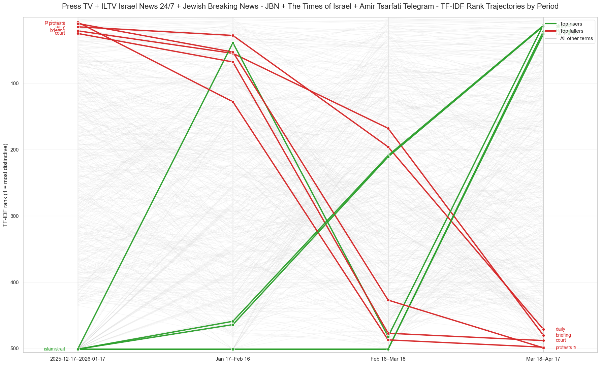

_Figure 6a. Rank trajectories for the strongest TF-IDF movers across the four pooled time bins._

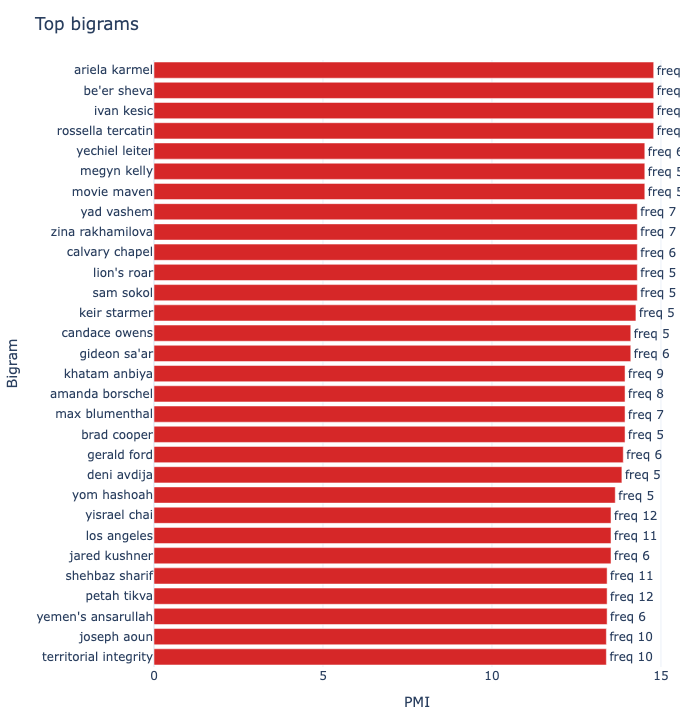

_Figure 6b. Static export of the top-bigram bar chart._

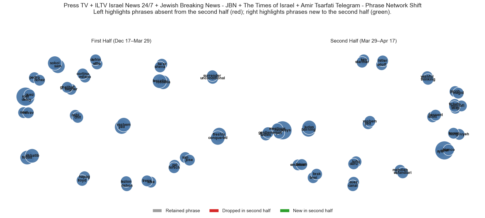

_Figure 6c. Temporal phrase-comparison panel between the first and second half of the corpus._

_Interactive notebook exports for this section: [Phrase network](./assets/all-channels/phrase_network.html) · [Phrase bigram bar chart](./assets/all-channels/phrase_bigram_bar.html)_

The lexical section divides the topic-ready text into four equal time bins:

- **2025-12-17–2026-01-17** — 295 messages
- **Jan 17–Feb 16** — 459
- **Feb 16–Mar 18** — 1,197
- **Mar 18–Apr 17** — 3,143

The strongest risers are:

- **ceasefire**
- **hormuz**
- **strait**
- **blockade**
- **islamabad**

The strongest fallers are:

- **protesters**
- **protests**
- **court**
- **briefing**
- **daily**

This is a coherent directional shift. The late pooled corpus is more about:

- maritime choke points,
- ceasefire language,
- strategic blockade framing,
- diplomacy / negotiation,
- and Trump / Iran signaling,

while the early pooled corpus contains proportionally more:

- domestic protest language,
- court / legal language,
- and newsroom-style “briefing / daily” packaging.

But because this is a combined corpus, the right interpretation is not “the narrative changed and only the narrative changed.” It is:

1. **events changed**, and
2. **the mixture of channels represented in the later period changed too**.

That same hybrid structure shows up even more sharply in the phrase outputs.

### PMI-ranked bigrams: bylines, names, and channel-specific signatures

Top PMI bigrams include:

- **ariela karmel**
- **be'er sheva**
- **ivan kesic**
- **rossella tercatin**
- **yechiel leiter**
- **movie maven**
- **megyn kelly**
- **yad vashem**
- **zina rakhamilova**
- **calvary chapel**

That is not one unified editorial fingerprint. It is a pooled mix of:

- **Times of Israel bylines / newsroom motifs**,
- **named individuals and locations**,
- **Behold Israel event / faith language**,
- and general conflict reporting.

### Weighted phrase-network edges: boilerplate plus conflict compounds

The network-weighted bigram table tells a different story:

- **follow links** — weight 839
- **group follow** — 839
- **strait hormuz** — 279
- **southern lebanon** — 240
- **united states** — 239
- **air force** — 204
- **ballistic missile** — 200
- **prime minister** — 153
- **donald trump** — 153
- **president donald** — 150

This is the combined corpus in miniature.

- The **PMI table** picks up distinctive names and bylines.
- The **weighted network** picks up repeated templates and conflict compounds.
- The huge **follow links / group follow** pair shows that JBN boilerplate is strong enough to dominate the phrase graph by weight.

So the phrase layer does not yield one clean “voice.” It yields a **braided lexicon** made of newsroom bylines, promotional template language, and war-reporting compounds.

---

## 7. Threading: sparse overall, informative mostly as a within-channel proxy

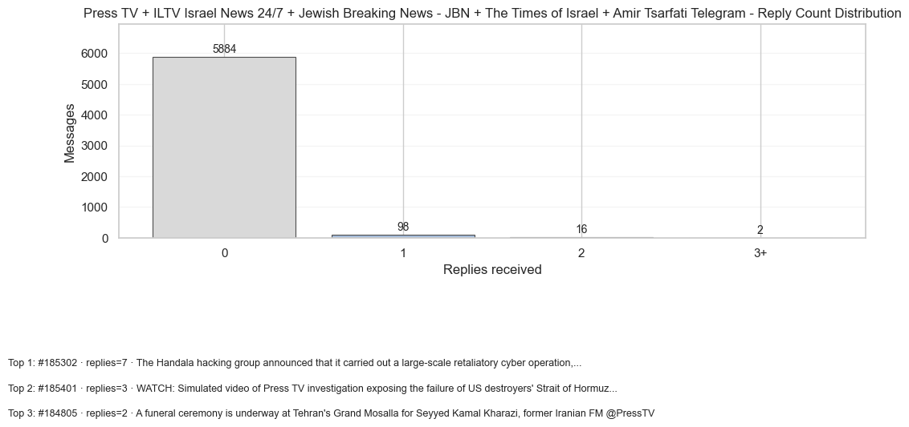

_Figure 7a. Reply-count distribution across the 6,000-message pooled corpus._

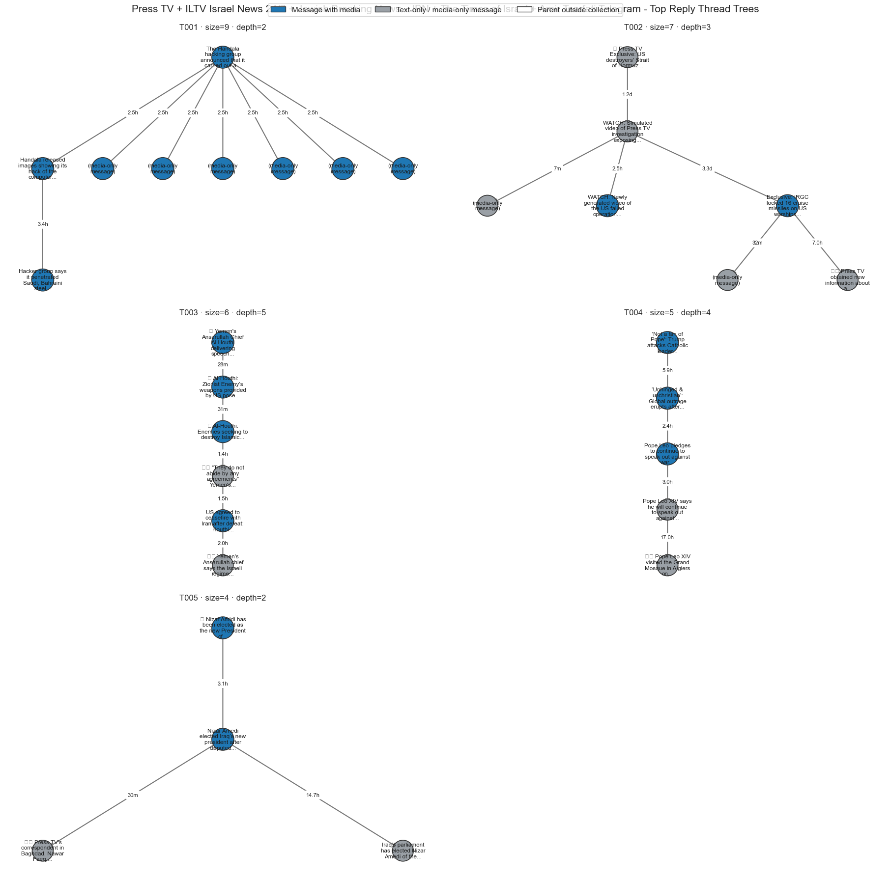

_Figure 7b. Largest reply-thread diagrams extracted from the notebook output._

The reply-threading summary reports:

- **145** total reply edges
- **140** edges whose parent message is also in the dataset
- **116** messages receiving replies
- **1.9%** of all messages receiving replies
- **Largest thread size:** 9
- **Deepest thread depth:** 5
- **Max replies to one message:** 7
- **Median first-reply lag:** 92.8 minutes

That is a low base rate. In a 6,000-message pooled corpus, replies remain a minority behavior.

The feature tests still surface two useful differences:

- Replied-to messages are **longer** than unreplied ones (median **248.5** vs **216.0** characters, **p = 0.0139**)
- Messages with media are **more likely** to receive replies (**2.31%** vs **1.32%**, **p = 0.0087**)

The reply-count distribution is highly skewed:

- **0 replies:** 5,884 messages (**98.1%**)
- **1 reply:** 98 (**1.6%**)
- **2 replies:** 16 (**0.3%**)
- **3+ replies:** 2

The top visible threads in the saved notebook outputs are also revealing. Their preview texts are dominated by what look like **PressTV-origin update chains** — e.g. Handala cyber-operation coverage and Strait-of-Hormuz investigation updates. So even inside the pooled dataset, reply threading still seems to behave like a **channel-local story-continuation mechanism** rather than a cross-channel discourse structure.

That matters because the notebook itself warns that message IDs are only unique *within* a channel. So the safe conclusion is:

- reply analysis is still worth keeping,
- but it should be interpreted as a **light engagement proxy**,
- and especially as a **within-channel continuation signal**,
- not as evidence of genuine pooled conversational threads across the five outlets.

---

## 8. Media strategy: pooled media and text-only posts are clearly different products

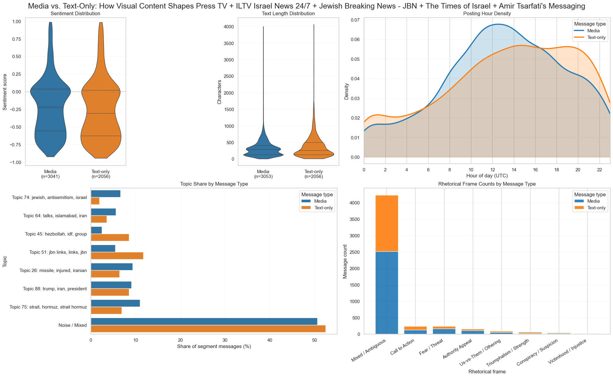

_Figure 8a. Summary dashboard comparing media-bearing and text-only messages._

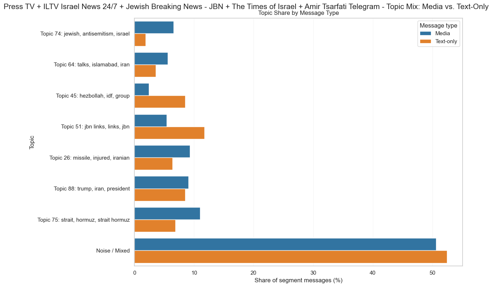

_Figure 8b. Topic-share differences between media-bearing and text-only posts._

The media-vs-text section is one of the cleanest statistical parts of the notebook.

At the raw level:

- **Media:** 3,720 messages (**62.0%**)
- **Text-only:** 2,280 (**38.0%**)
- **Media with text:** 3,053
- **Media-only:** 667
- **Text-only with text:** 2,056

Segment summary:

| Segment | Messages | Share | Mean text length | Median text length | Mean sentiment | Median sentiment |
|---|---:|---:|---:|---:|---:|---:|
| Media | 3,720 | 62.0% | 321.2 | 284.0 | -0.218 | -0.222 |
| Text-only | 2,280 | 38.0% | 373.6 | 260.0 | -0.263 | -0.308 |

Stat-test summary:

- **Text length** — significant (**p = 0.0074**)
- **Sentiment score** — significant (**p = 0.000009**)
- **Posting hour distribution** — significant (**p < 0.001**)
- **Dominant sentiment** — significant (**p = 0.000006**)
- **Dominant emotion** — significant (**p < 0.001**)
- **Dominant topic** — very strongly significant (**p < 0.001**, **effect size 0.4086**)
- **Dominant frame** — significant (**p = 0.000002**)

The biggest substantive differences are topic-level.

### Media over-indexes on:

- **Topic 74: jewish, antisemitism, israel** (**+4.7 pts**)
- **Topic 75: strait, hormuz, strait hormuz** (**+4.1 pts**)
- **Topic 26: missile, injured, iranian** (**+2.9 pts**)
- **Topic 64: talks, islamabad, iran** (**+2.0 pts**)

### Text-only over-indexes on:

- **Topic 51: jbn links, links, jbn** (**-6.3 pts from media's perspective**)
- **Topic 45: hezbollah, idf, group** (**-6.1 pts**)

The frame split is directionally similar.

### Media over-indexes on:

- **Fear / Threat** (**+2.3 pts**)
- **Authority Appeal** (**+0.9 pts**)

### Text-only over-indexes on:

- **Triumphalism / Strength** (**-1.3 pts from media's perspective**)
- **Call to Action** (**-1.1 pts**)

The TF-IDF segment terms make the split even more concrete.

### Media-distinctive terms include:

- **talks** (lift **2.257**)
- **new** (**1.895**)
- **netanyahu** (**1.675**)
- **trump** (**1.282**)

### Text-only-distinctive terms include:

- **tehran** (lift **1.809**)
- **links** (**1.756**)
- **follow** (**1.707**)
- **group** (**1.539**)
- **regime** (**1.350**)

The best way to read that result is structurally rather than psychologically.

In a pooled corpus like this, the media/text split is not just “the same stories with and without pictures.” It is capturing a mixture of:

- TOI's link-preview-heavy article feed,
- JBN's link / follow / group template language,
- conflict footage and photo posts,
- official quote cards,
- and channel-specific packaging habits.

So yes, media and text-only are strongly different in the combined notebook. But that is largely because **different channels use formats differently**, not because the pooled corpus has one unified media strategy.

---

## Conclusion

`notebooks/allchannels.ipynb` is useful, but it answers a different question than the single-channel or side-by-side channel notebooks.

It does **not** tell us how each outlet behaves in isolation. Instead, it shows what happens when five 1,200-message channel windows are merged into one narrative field.

That pooled field has a few stable properties.

### 1. It is structurally late-heavy

The corpus expands sharply into March-April, so later periods combine more channels and more events. Any temporal claim has to keep that composition effect in view.

### 2. It still centers emotionally on fear and negativity

Even after pooling five different editorial styles, the baseline remains:

- negative mean sentiment,
- neutral-label plurality,
- and fear as the dominant emotion.

### 3. It fragments thematically but recenters on the same actor core

The topic map breaks into many small clusters plus a large noise bucket, but the entity graph still snaps back to **Iran, Israel, the US, Trump, Hezbollah, Lebanon, Tehran, and IDF**.

### 4. It exposes channel fingerprints inside the pooled outputs

The combined run makes several channel-specific traces visible without formally separating the outlets:

- **TOI-style bylines and briefing language**
- **JBN follow/group/links boilerplate**
- **Hormuz / blockade / missile / Lebanon conflict vocabulary**
- **Behold Israel event / faith-adjacent phrase traces**
- **PressTV-style threaded update chains**

That is arguably the most useful first-pass takeaway: the pooled notebook does not erase channel identity. It shows how those identities coexist and compete inside one merged corpus.

### 5. It is best used alongside, not instead of, the comparison articles

For channel-by-channel comparison, the better reference remains the dedicated write-ups, especially [`docs/israel-news-channels-analysis.md`](israel-news-channels-analysis.md) and the single-channel analyses. But for a high-level view of the **shared narrative landscape** across the repo's current five-channel notebook, `allchannels.ipynb` already provides a solid MVP.

## Supporting files

Source notebook:

- [`notebooks/allchannels.ipynb`](../notebooks/allchannels.ipynb)

Extracted assets used in this report:

- Figures / HTML exports: [`docs/assets/all-channels/`](./assets/all-channels/)
- Tables / CSV exports: [`docs/assets/all-channels/data/`](./assets/all-channels/data/)

Representative table exports:

- [`summary.json`](./assets/all-channels/data/summary.json)
- [`topic_summary.csv`](./assets/all-channels/data/topic_summary.csv)
- [`entity_summary.csv`](./assets/all-channels/data/entity_summary.csv)
- [`cadence_top_spikes.csv`](./assets/all-channels/data/cadence_top_spikes.csv)
- [`media_text_stat_tests.csv`](./assets/all-channels/data/media_text_stat_tests.csv)

Key interactive exports:

- [Topic scatter](./assets/all-channels/topic_scatter.html) · [Topic prevalence](./assets/all-channels/topic_prevalence.html) · [Topic over time](./assets/all-channels/topic_time.html)
- [Entity bar chart](./assets/all-channels/entity_top_entities.html) · [Entity network](./assets/all-channels/entity_network.html)
- [Rhetoric over time](./assets/all-channels/rhetoric_over_time.html) · [Rhetoric transition](./assets/all-channels/rhetoric_transition.html)
- [Phrase network](./assets/all-channels/phrase_network.html) · [Phrase bigram bar chart](./assets/all-channels/phrase_bigram_bar.html)

Key static figures embedded above now live alongside those HTML files, including the cadence, sentiment, topic, entity, rhetoric, TF-IDF, phrase, reply-threading, and media-vs-text PNG exports.
