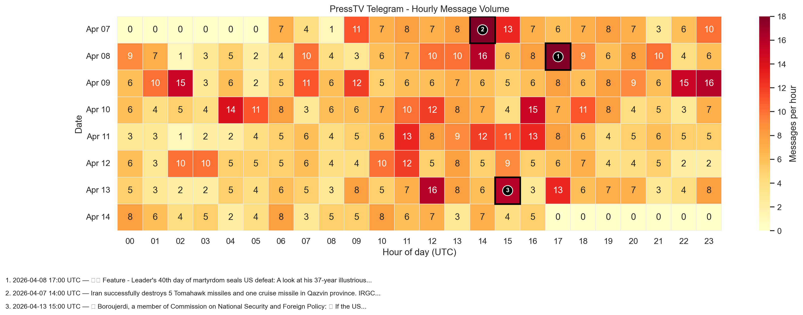
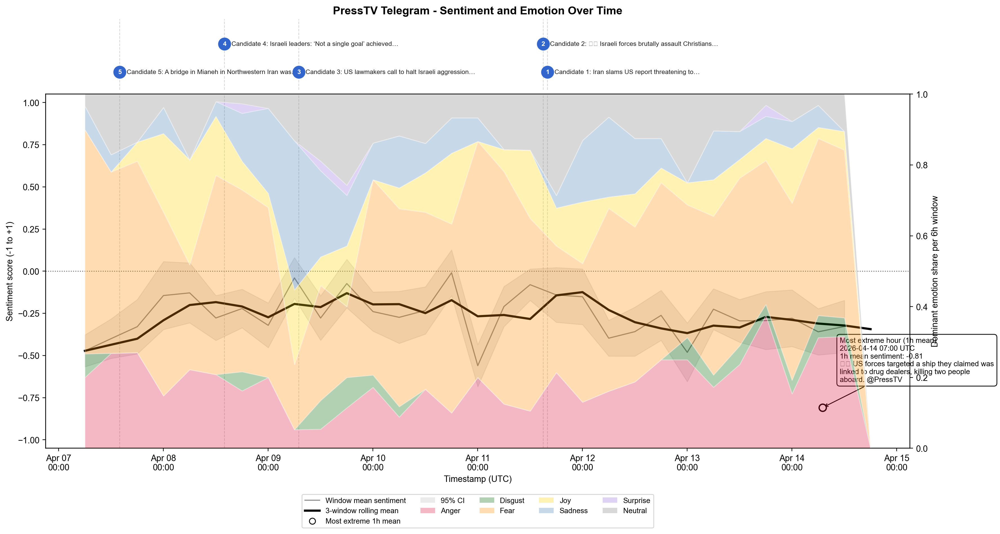
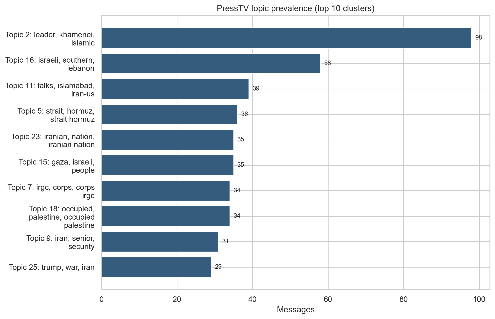
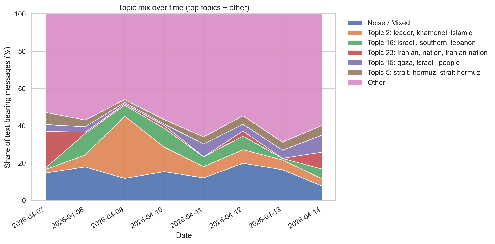
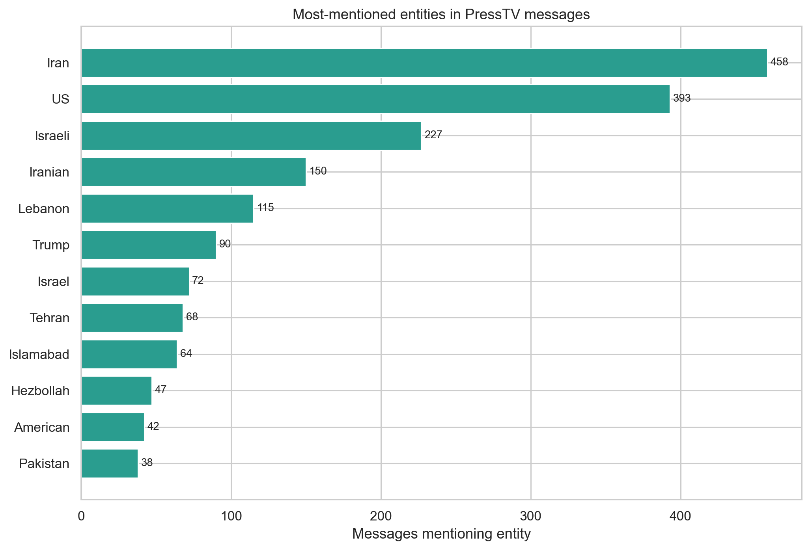
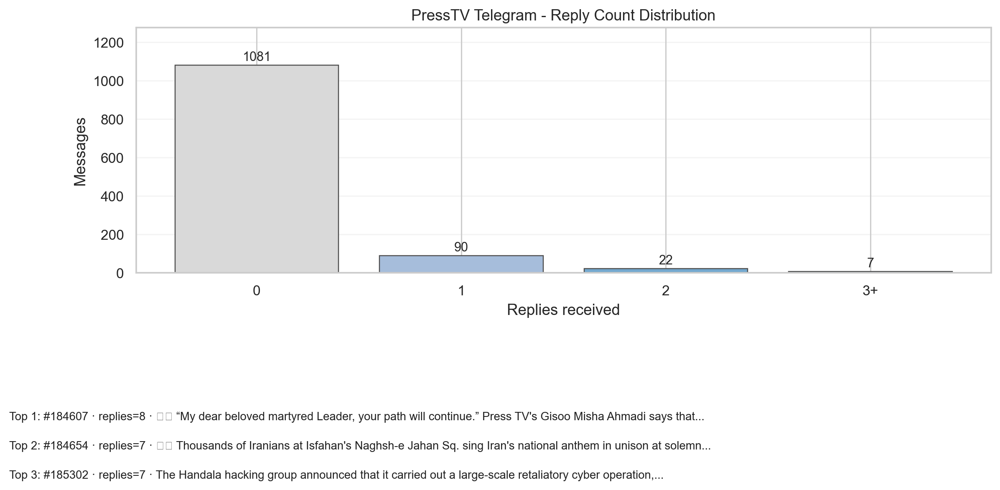
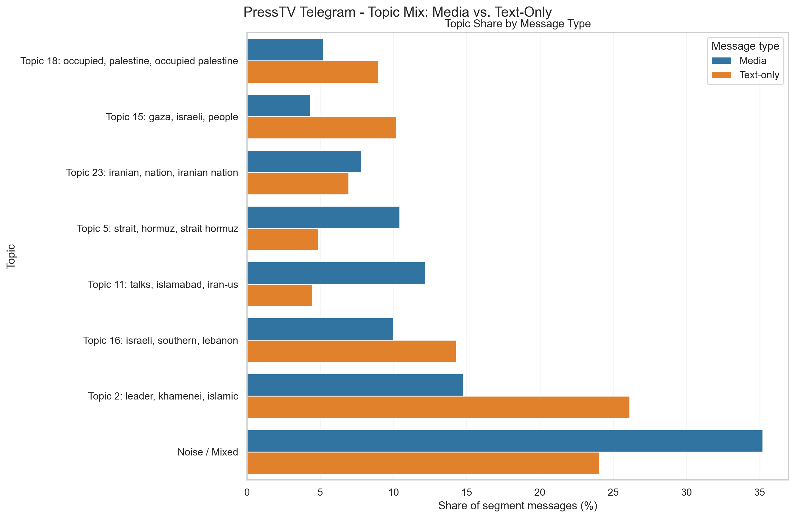

# PressTV on Telegram: an 8-day notebook-based analysis

This article analyzes the PressTV Telegram channel using the figures produced from the same analysis sections implemented in [`notebooks/pipeline.ipynb`](../notebooks/pipeline.ipynb), regenerated against [`notebooks/messages.csv`](../notebooks/messages.csv) and exported to [`docs/assets/presstv-analysis/`](./assets/presstv-analysis/).

## Executive summary

Three patterns stand out most clearly.

1. **PressTV is a high-volume, media-heavy channel.** Across the 8-day sample it averaged **150 messages per day**, and **63.5%** of all posts carried media.
2. **Its emotional baseline is fear rather than optimism.** The average sentiment score across text-bearing posts is **-0.25**, while **fear** is the dominant emotion in **446 of 945** scored messages.
3. **Its narrative focus shifts, but its geopolitical center does not.** The largest topic cluster is around **Leader/Khamenei/Islamic-revolution memorial coverage**, while the entity network remains tightly anchored on **Iran, the US, Israel/Israeli actors, Lebanon, Trump, and Islamabad**.

A second-order finding is just as important: **media is not decorative**. Media posts and text-only posts differ significantly in **length, posting-hour distribution, emotion mix, and topic mix**, which suggests that visuals are being used strategically for certain kinds of stories rather than simply attached at random.

## Scope and method

This write-up covers the exported PressTV sample in `notebooks/messages.csv`:

| Metric | Value |
|---|---:|
| Total messages | 1,200 |
| Text-bearing messages | 945 |
| Media-bearing messages | 762 |
| Media share | 63.5% |
| Messages with `reply_to_message_id` | 171 |
| Date range | 2026-04-07 06:13 UTC to 2026-04-14 16:59 UTC |

Notes:

- All timestamps below are **UTC**.
- Figures come from the same notebook analysis modules used by `pipeline.ipynb`.
- For topic modeling, I regenerated the notebook topic section offline using local semantic vectors so the clusters should be read as **approximate thematic neighborhoods**, not immutable labels.

---

## 1. Cadence: PressTV behaves like a fast, media-first wire

_Figure 1. Hour-by-hour message volume across the full 8-day sample._

The cadence heatmap shows a channel that posts continuously, but not uniformly.

- The sample averages **150.0 messages per day**.
- The **busiest day** is **2026-04-09** with **185 messages**.
- The single busiest hour is **2026-04-08 17:00 UTC** with **18 messages**.
- Across the week, activity is especially dense from roughly **11:00 to 17:00 UTC**, with a secondary late-evening presence.

The day-level summary reinforces that this is not a leisurely publishing cadence:

- Apr 7: **138** messages
- Apr 8: **172**
- Apr 9: **185**
- Apr 10: **175**
- Apr 11: **146**
- Apr 12: **142**
- Apr 13: **152**
- Apr 14: **90** (partial final day)

The spikes are also heavily visual. The ten biggest hourly spikes are mostly **75% to 94% media-bearing**, which implies that PressTV leans on images and clips when it wants to dominate attention during intense news windows.

A useful way to read this is that PressTV looks less like a single daily bulletin and more like a **rolling crisis stream**: steady throughput, bursts around event moments, and a clear preference for packaging those bursts with media.

---

## 2. Tone: the channel is fear-heavy, negative-leaning, and only rarely positive

_Figure 2. Notebook Section 6 sentiment timeline for PressTV._

Across all **945** text-bearing messages that were scored:

- Mean sentiment score: **-0.25**
- Dominant sentiment labels:
  - **Neutral:** 558 messages (**59.0%**)
  - **Negative:** 338 (**35.8%**)
  - **Positive:** 49 (**5.2%**)
- Dominant emotions:
  - **Fear:** 446 (**47.2%**)
  - **Anger:** 172 (**18.2%**)
  - **Neutral:** 110 (**11.6%**)
  - **Sadness:** 96 (**10.2%**)
  - **Joy:** 96 (**10.2%**)

The combination matters. The channel is not “negative” in the sense of every post being strongly negative; in label terms, **neutral** is still the largest class. But the aggregate emotional balance remains clearly negative because the neutral reporting sits inside a broader framing environment dominated by **threat, danger, retaliation, destruction, and loss**.

The daily series sharpens that picture:

- **Most negative day:** Apr 7, mean sentiment **-0.396**
- **Least negative day:** Apr 9, mean sentiment **-0.166**
- Tone turns more negative again on **Apr 12–14** (roughly **-0.30 to -0.32**)

So the channel briefly softens on Apr 9 without becoming upbeat. That dip coincides with a strong wave of memorial and ceremonial coverage, which introduces more solemnity and symbolic unity than immediate battlefield shock. Even then, **fear remains the dominant emotion every single day** in the sample.

The most extreme hour in the entire run is **2026-04-14 07:00 UTC**, where the mean sentiment falls to **-0.809**, tied to a short cluster of stories about a fatal US strike at sea. That is a good example of how the timeline is best read: not as an abstract mood line, but as a proxy for which kinds of events the channel is emphasizing at a given moment.

---

## 3. Themes: memorialization dominates, but the channel keeps switching theaters

_Figure 3. Top topic clusters from the notebook topic-modeling section._

The topic model shows a channel with a clear center of gravity but a broad outer ring. The largest cluster is:

- **Topic 2: leader / khamenei / islamic** — **98 messages**

After that, the major clusters are spread across several related theaters:

- **israeli / southern / lebanon** — **58**
- **talks / islamabad / iran-us** — **39**
- **strait / hormuz** — **36**
- **iranian nation / war-crimes style framing** — **35**
- **gaza / israeli / people** — **35**
- **irgc** — **34**
- **occupied palestine** — **34**

Two things follow from this.

First, the channel is **not** a one-story outlet. Even in an 8-day slice, it spreads attention across war reporting, diplomatic negotiation, symbolic state messaging, Lebanon, Gaza, maritime coercion, and official military signaling.

Second, it still has a clear editorial hierarchy. The biggest single cluster is not generic battlefield reporting; it is **leadership, mourning, and ideological-political legitimacy**.

_Figure 4. Share of major topics over time._

The timeline makes the shift clearer:

- **Apr 7** is led by **“iranian nation”** language, with war-crimes and confrontation framing prominent.
- **Apr 9** is overwhelmingly shaped by **Leader/Khamenei** coverage, which reaches **33.3%** of text-bearing messages that day.
- **Apr 11** tilts toward **talks / Islamabad / Iran-US**, where that cluster becomes the leading topic at **16.7%**.
- By the back half of the sample, **Hormuz/blockade**, negotiations, and external political reactions are more visible than in the opening burst.

That means PressTV is doing more than repeating a single anti-US/anti-Israel line. It is moving among several narrative modes:

1. **threat and attack reporting**
2. **state legitimacy and memorialization**
3. **negotiation / diplomacy**
4. **maritime pressure and strategic leverage**

Interactive notebook exports for this section:

- [Topic scatter](./assets/presstv-analysis/topic_scatter.html)
- [Topic prevalence](./assets/presstv-analysis/topic_prevalence.html)
- [Topic over time](./assets/presstv-analysis/topic_time.html)

---

## 4. Actors: the narrative world is broad, but the core triangle is Iran–US–Israel

_Figure 5. Most-mentioned entities extracted from the corpus._

Even after filtering the entity graph to entities mentioned in at least three messages, the network still contains **113 nodes** and **400 edges**. So the channel is not tiny in scope. But most of the weight sits on a small number of actors:

- **Iran** — 458 messages
- **US** — 393
- **Israeli** — 227
- **Iranian** — 150
- **Lebanon** — 115
- **Trump** — 90
- **Israel** — 72
- **Tehran** — 68
- **Islamabad** — 64
- **Hezbollah** — 47

The strongest co-occurrence pairs are even more revealing:

- **Iran ↔ US:** 269 co-mentions
- **Israeli ↔ US:** 93
- **Iran ↔ Israeli:** 91
- **Israeli ↔ Lebanon:** 68
- **Iranian ↔ US:** 64
- **Iran ↔ Islamabad:** 53
- **Trump ↔ US:** 49

That gives a concise description of the channel’s narrative architecture:

- **Iran vs the US** is the core dyad.
- **Israel/Israeli** acts as the main military and moral antagonist alongside the US.
- **Lebanon** is the most important secondary conflict theater.
- **Islamabad/Pakistan** becomes a major secondary diplomatic node.
- **Trump** personalizes the US pole of the conflict.

So while the topic model shows thematic variation, the entity graph shows a much tighter structure: PressTV repeatedly returns to a **stable cast of geopolitical protagonists and antagonists**.

Interactive notebook exports for this section:

- [Entity bar chart](./assets/presstv-analysis/entity_top_entities.html)
- [Entity network](./assets/presstv-analysis/entity_network.html)

---

## 5. Language shifts: from early shock and triumphalism to talks, blockade, and maritime pressure

Even without another embedded figure, the lexical outputs tell a coherent story.

The strongest rising terms over the sample are:

- **blockade**
- **naval**
- **talks**
- **islamabad**
- **pope**

The strongest falling terms are:

- **victory**
- **synagogue**
- **forced**
- **beirut**
- **late**

That suggests a shift away from the opening mix of **immediate strike reporting, damage, and triumphalist or memorial language**, and toward a later-stage vocabulary of **negotiation, maritime leverage, external political commentary, and diplomatic theatre**.

The phrase outputs point in the same direction. Among the most recurring bigrams are:

- **tel aviv**
- **raid sirens**
- **persian gulf**
- **naim qassem**
- **shehbaz sharif**
- **red crescent**
- **strait / hormuz** terms in the larger topic clusters

So PressTV’s language is not only ideological; it is also highly **template-driven**. It cycles through repeatable phrase packages that tie places, elites, and conflict events together in recognisable editorial frames.

If you want to inspect the notebook exports directly, see:

- [TF-IDF bump chart](./assets/presstv-analysis/tfidf_bump.png)
- [TF-IDF terms figure](./assets/presstv-analysis/tfidf_terms.png)
- [Phrase network](./assets/presstv-analysis/phrase_network.html)
- [Phrase bigram bar chart](./assets/presstv-analysis/phrase_bigram_bar.html)

---

## 6. Threading: replies are rare, but they reveal which stories PressTV chooses to sustain

_Figure 6. Distribution of reply counts across messages._

Replies are scarce in percentage terms, but analytically valuable:

- Total reply edges: **171**
- Messages receiving at least one reply: **119**
- Share of all messages receiving replies: **9.9%**
- Largest thread: **22 messages**
- Deepest thread depth: **7**
- Maximum replies to a single message: **8**
- Median first-reply lag: **95.6 minutes**

This means most PressTV posts are **standalone dispatches**. But when the channel does thread, it uses threading to sustain particular stories rather than to casually annotate everything.

The biggest thread in the sample is especially revealing: a **22-message**, **7-level** chain on **Apr 9** centered on the 40th day of mourning for Ayatollah Khamenei. That aligns with the topic model’s finding that memorial/leadership content temporarily became the channel’s strongest thematic concentration.

The feature tests add another useful distinction:

- Messages that receive replies are **significantly longer** than unreplied messages (median **199** vs **160** characters, **p < 0.001**).
- Having media does **not** significantly change the reply rate (**10.37%** for media vs **9.13%** for non-media, **p = 0.556**).

So reply behavior looks like a marker of **story salience and elaboration**, not of mere visual attractiveness. PressTV seems to thread when a story is worth continuing, not just when it has a dramatic image.

---

## 7. Media strategy: visuals are used selectively, not indiscriminately

_Figure 7. Topic distribution differences between media-bearing and text-only posts._

This is one of the clearest strategic findings in the dataset.

At the raw level:

- **762** of 1,200 posts carry media (**63.5%**)
- **218** of those media posts are **media-only**
- Media posts that do contain text are longer than text-only posts:
  - median text length: **200** vs **162**
  - difference is statistically significant (**p < 0.001**)

But the more important point is that media and text-only posts are **not** just two wrappers for the same content.

### What does *not* change much

- Sentiment score difference is **not significant** (**p = 0.157**)
- Dominant sentiment distribution is **not significant** (**p = 0.461**)

So media is not simply “more emotional” in a coarse positive/negative sense.

### What *does* change

- Posting-hour distribution differs (**p = 0.0078**)
- Dominant emotion distribution differs (**p = 0.000088**)
- Topic distribution differs strongly (**p < 0.001**)

The topic gaps are particularly informative:

- **Media over-indexes on**:
  - **talks / Islamabad / Iran-US** (**+7.7 percentage points**)
  - **Strait / Hormuz** (**+5.5 pts**)
- **Text-only over-indexes on**:
  - **leader / khamenei / islamic** (**-11.3 pts from media’s perspective; much more text-only-heavy**)
  - **gaza / israeli / people** (**text-only advantage of 5.9 pts**)

The vocabulary split says the same thing in different words.

**Media-heavy vocabulary** includes:
- ceasefire
- talks
- president
- strait
- hormuz
- IRGC

**Text-only vocabulary** over-indexes on:
- leader
- Tehran
- ayatollah
- khamenei
- people
- southern

That suggests PressTV uses visuals most aggressively for **official diplomacy, state actors, strategic geography, and military posture**, while text-only posts lean more toward **ideological, commemorative, and moral-political narration**.

In other words: the channel’s visuals are part of its editorial architecture. They are not just thumbnails.

---

## Conclusion

Using the notebook figures as a guide, PressTV in this 8-day sample looks like a channel with four defining characteristics.

### 1. It is structurally built for high-tempo crisis coverage
The posting cadence is too dense to read as periodic commentary. It behaves like a running news stream, with strong bursts around event windows and a clear bias toward media-rich spikes.

### 2. Its emotional center of gravity is fear
Even when sentiment labels skew “neutral,” the emotional register is dominated by fear, anger, and threat language. The result is a channel that often sounds controlled in tone but still orients the reader toward danger and confrontation.

### 3. Its narrative is diversified, but not decentralized
Topic clusters vary from mourning to Lebanon to diplomacy to maritime pressure, yet the actor network remains tightly centered on Iran, the US, Israel/Israeli actors, Lebanon, Trump, and Islamabad. The stories change; the cast stays remarkably stable.

### 4. Its use of media is strategic
Media-bearing posts differ from text-only posts in timing, topic, and emotional mix. PressTV appears to reserve visuals especially for diplomacy, official actors, and strategic signaling, while text-only posts carry more commemorative and ideological load.

Taken together, that makes PressTV look less like a generic Telegram news feed and more like a **disciplined narrative system**: one that mixes live conflict reporting, state symbolism, diplomatic theater, and visual packaging to steer attention across several related fronts while keeping the same geopolitical frame in view.

## Supporting files

Exported figures and tables used for this write-up live here:

- Figures: [`docs/assets/presstv-analysis/`](./assets/presstv-analysis/)
- Tables/CSVs: [`docs/assets/presstv-analysis/data/`](./assets/presstv-analysis/data/)

Key interactive exports:

- [Topic scatter](./assets/presstv-analysis/topic_scatter.html)
- [Entity network](./assets/presstv-analysis/entity_network.html)
- [Phrase network](./assets/presstv-analysis/phrase_network.html)
